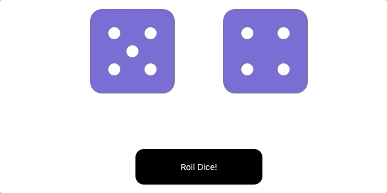

Simple app that lets you roll a pair of dice. It also displays an animation every time the dice are rolled.

This exercise practices working with props, defaultProps, state, and simple click events in React. 

This project was bootstrapped with [Create React App](https://github.com/facebook/create-react-app).

 Run:

### `npm start`

Runs the app in the development mode. 
Open [http://localhost:3000](http://localhost:3000) to view it in the browser.

